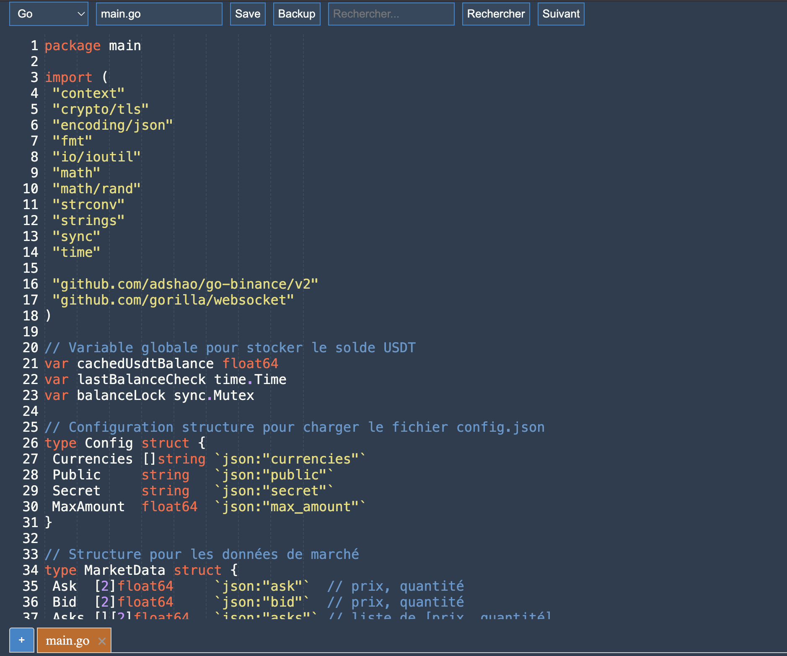

# NiceCode Editor

Welcome to NiceCode, a versatile web-based code editor designed to streamline and enhance your coding experience. Built with CodeMirror, NiceCode supports multiple programming languages and offers a clean, user-friendly interface with advanced features.

## Features

- **Multiple Language Support**: Code in HTML, JavaScript, Python, PHP, Golang and CSS.
- **Persistent Local Storage**: Your code is automatically saved in your browser's local storage, ensuring you never lose your work.
- **Multi-Tab Interface**: Work on multiple files simultaneously with a tabbed interface.
- **Drag and Drop File Loading**: Easily open files by dragging and dropping them into the editor.
- **New Tab Creation**: Create new tabs even when no tabs are open, allowing you to start fresh at any time.
- **Customizable Themes**: Comes with the Lucario theme for better code visibility and aesthetics.
- **Download Code**: Easily save your work to a file with the correct file extension.
- **Timestamped Backups**: Save versions of your files with timestamps, ideal for tracking changes and maintaining backups.
- **Automatic Function Detection**: Automatically detects and lists functions in the code for easy navigation.
- **Alphabetically Sorted Function List**: Functions are listed in alphabetical order for easier browsing.
- **Search and Highlight**: Find text within your code with search highlighting.
- **Next Occurrence Navigation**: Easily navigate through search results.
- **Perfect Copy-Paste Indentation**: Maintains the correct indentation when copying and pasting code into the editor.
- **Responsive Design**: Adapts to different screen sizes for a consistent experience across devices.

## How to Use

1. **Open Files**: Drag and drop files into the editor, or use the "+" button to create a new tab.
2. **Edit Code**: Use the powerful CodeMirror editor to write and edit your code.
3. **Switch Languages**: Select the appropriate language from the dropdown menu to enable syntax highlighting and language-specific features.
4. **Save Work**: Your work is automatically saved in the browser. Use the "Save" button to download your code as a file.
5. **Create Backups**: Use the "Backup" button to create timestamped versions of your files.
6. **Navigate Functions**: Use the function list on the right to quickly jump to different parts of your code.
7. **Search**: Utilize the search feature to find specific text in your code.

NiceCode Editor combines simplicity with powerful features to provide an efficient coding environment right in your browser. Whether you're working on quick scripts or complex projects, NiceCode has you covered.

## Installation

2. Open `NiceCode.html` in your browser.

## Contributing

Contributions are what make the open source community such an amazing place to learn, inspire, and create. Any contributions you make are **greatly appreciated**.

1. Fork the Project
2. Create your Feature Branch (`git checkout -b feature/AmazingFeature`)
3. Commit your Changes (`git commit -m 'Add some AmazingFeature'`)
4. Push to the Branch (`git push origin feature/AmazingFeature`)
5. Open a Pull Request

## License

Distributed under the MIT License. See `LICENSE` for more information.

## Acknowledgments

- [CodeMirror](https://codemirror.net/) for the powerful text editor framework.
- All contributors who spend time to help improve this project.
